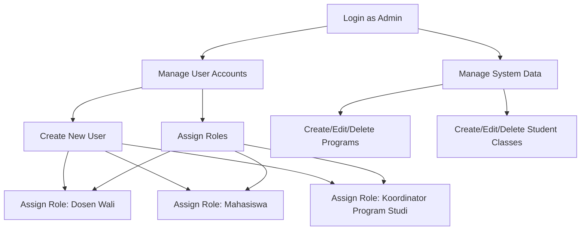
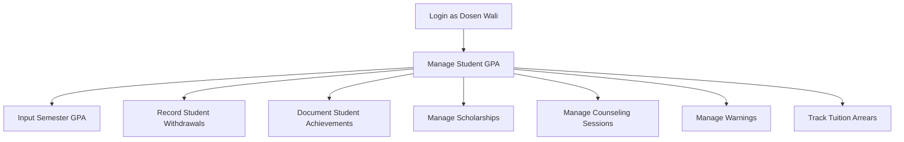
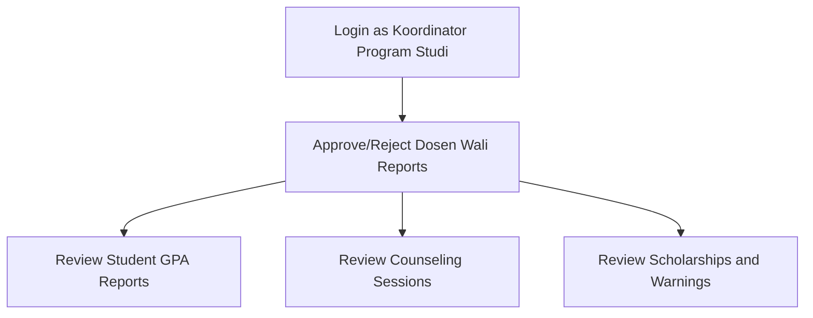
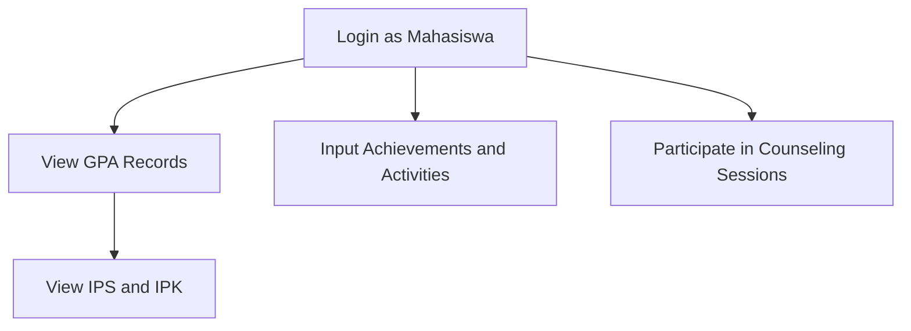

# JKB Academic Advising Information System

## Overview

JKB Academic Advising Information System (SIWALI JKB) is a comprehensive academic advising management system designed to streamline the process of managing student performance, counseling, and other academic data for higher education institutions.

## Features

### User Roles

The system supports four distinct user roles:

1. Admin
2. Dosen Wali (Academic Advisor)
3. Koordinator Program Studi (Program Coordinator)
4. Mahasiswa (Student)

### Role-specific Functionalities

#### 1. Admin

- Can manage all data within the system, except for student performance records and counseling sessions.
- Responsible for user management, including:
  - Creating new user accounts
  - Assigning roles (Dosen Wali, Koordinator Program Studi, or Mahasiswa) to users

#### 2. Dosen Wali (Academic Advisor)

- Manage and input students' semester GPA (IPS)
- Record students who have withdrawn (dropout) or are recipients of scholarships/revised tuition (UKT) reviews
- Document student achievements and organizational activities
- Manage records of students who have been issued warning letters
- Track tuition arrears
- Conduct online academic counseling (bimbingan perwalian)

#### 3. Koordinator Program Studi (Program Coordinator)

- Approve or reject reports submitted by Dosen Wali

#### 4. Mahasiswa (Student)

- View their semester GPA (IPS) and cumulative GPA (IPK)
- Input student achievements and organizational activities
- Participate in online academic counseling (bimbingan perwalian)

## ERD


## Entities

1. **users**:Stores user account information, including email, avatar, and password.
2. **programs**: Represents different academic programs offered, including program code, name, degree (D3/D4), and the head of the program.
3. **classes**: Represents classes or cohorts of students, including the academic year, program ID, and academic advisor ID.
4. **positions**: Stores different positions within the institution, such as Academic Advisor and Program Coordinator, including their decree.
5. **students**: Stores information about individual students, including student number, name, contact information, and their class ID.
6. **lecturers**: Contains data about faculty members, including NIDN, NIP, contact information, position ID, and their user ID.
7. **gpas**: Stores GPA information for classes.
8. **gpas_cumulative**: Stores cumulative GPA for individual students, linked to a specific GPA record.
9. **gpas_semester**: Detailed GPA information per semester for each student.
10. **achievements**: Records student achievements.
11. **achievement_details**: Detailed records of individual student achievements, including the type and level of achievement.
12. **scholarships**: Manages information on student scholarships.
13. **scholarship_details**: Detailed records of individual student scholarships, including the type of scholarship.
14. **guidances**: Manages student counseling records.
15. **guidance_details**: Detailed records of individual student counseling sessions, including the problem and solution.
16. **warnings**: Documents warnings issued to students.
17. **warning_details**:Detailed records of individual warnings issued to students, including the type of warning and reason.
18. **tuition_arrears**: Manages records of unpaid tuition fees.
19. **tuition_arrear_details**: Detailed records of individual student tuition arrears, including the amount.
20. **student_withdrawals**: Manages records of students who have withdrawn from the program within a specific class.
21. **student_withdrawals**: Detailed records of individual student withdrawals, including the type of withdrawal, decree number, and reason.
22. **reports**: Represents reports generated by lecturers, including report date, status, and approval flags from academic advisors and heads of programs.

    
## Relationships

1. **users - students/lecturers**: One-to-one relationship. Each user account is associated with either a student or a lecturer.                                      

2. ***programs - classes**: One-to-many relationship. A program can have multiple classes.

3. **classes - academic_advisors**: One-to-one relationship. Each class is assigned one academic advisor who is a lecturer.

4. **programs - head_of_program**: One-to-one relationship. Each program is headed by one lecturer who serves as the head of the program.

5. **positions - lecturers**: One-to-many relationship. Each position can be held by multiple lecturers.

6. **classes - students**: One-to-many relationship. Each class can have multiple students.

7. **gpas - classes**: One-to-one relationship. Each class has one GPA record.

8. **gpas_cumulative** - students: One-to-one relationship. Each student has one cumulative GPA record.

9. **gpas_cumulative - gpas**: One-to-many relationship. Each GPA record can have multiple cumulative GPA entries.

10. **gpas_semester - gpas_cumulative**: One-to-many relationship. Each cumulative GPA record can have multiple semester GPA entries.

11. **achievements - classes**: One-to-one relationship. Each class can have one achievements.

12. **achievement_details - achievements**: One-to-many relationship. Each achievement can have multiple detailed records for different students.

13. **students - achievement_details**: One-to-many relationship. Each student can have multiple achievement.

14. **scholarships - classes**: One-to-one relationship. Each class can have one scholarships.

15. **scholarship_details - scholarships**: One-to-many relationship. Each scholarship can have multiple detailed records for different students.

16. **students - scholarship_details**: One-to-many relationship. Each student can have multiple scholarship_details.

17. **guidances - classes**: One-to-one relationship. Each class can have one guidance sessions.

18. **guidance_details - guidances**: One-to-many relationship. Each guidance session can have multiple detailed records for different students.

19. **students - guidance_details**: One-to-many relationship. Each student can have multiple guidance_details.

20. **warnings - classes**: One-to-one relationship. Each class can have one warnings issued.

21. **warning_details - warnings**: One-to-many relationship. Each warning can have multiple detailed records for different students.

22. **students - warnings**: One-to-many relationship. Each student can have multiple warnings.

23. **tuition_arrears - classes**: One-to-one relationship. Each class can have one tuition arrears records.

24. **tuition_arrears_details - tuition_arrears**: One-to-many relationship. Each tuition arrears record can have multiple detailed entries for different students.

25. **students - tuition_arrears**: One-to-many relationship. Each student can have multiple tuition_arrears.
    
26. **student_withdrawals - classes**: One-to-one relationship. Each class can have one student withdrawals.

27. **student_withdrawal_details - student_withdrawals**: One-to-many relationship. Each student withdrawal can have multiple detailed records.

28. **students - student_withdrawal_details**: One-to-one relationship. Each student have one student_withdrawal_details.

29. **reports - lecturers**: One-to-one relationship. Each report is generated by one lecturer.

30. **reports - gpas**: One-to-one relationship. Each report is linked to one GPA record.

31. **reports - achievements**: One-to-one relationship. Each report is linked to one set of achievements.

32. **reports - guidances**: One-to-one relationship. Each report is linked to one set of guidance sessions.

33. **reports - scholarships**: One-to-one relationship. Each report is linked to one set of scholarships.

34. **reports - student_withdrawals**: One-to-one relationship. Each report is linked to one set of student withdrawals.

35. **reports - warnings**: One-to-one relationship. Each report is linked to one set of warnings.

36. **reports - tuition_arrears**: One-to-one relationship. Each report is linked to one set of tuition_arrears.
## Key Features

- The system supports soft deletes (deleted_at column) for most entities, allowing for data recovery and historical tracking.
- Timestamps (created_at, updated_at) are used across all tables for auditing purposes.
- The structure supports complex relationships between courses, lecturers, and students, allowing for flexible academic management.
- GPA, achievements, scholarships, and counseling systems are tightly integrated with the student management aspects of the database.

## Flowchart

### Admin Flowchart

### Dosen wali (Academic Advisor) Flowchart

### Koordinator Program Studi (Program Coordinator) Flowchart

### Mahasiswa (Student) Flowchart


## Installation

1. Clone the repository:
```
git clone https://github.com/Protic-PNC/jkb-sistem-perwalian.git
cd jkb-sistem-perwalian
```
2. Install dependencies:
```
composer install
npm install
npm run dev
```
3. Set up the environment:

Copy the .env.example file to .env and update the necessary environment variables.
```
cp .env.example .env
php artisan key:generate
```
4. Run database migrations:
```
php artisan migrate
```
5. Seed the database:
```
php artisan db:seed
```
6. Start the development server:
```
php artisan serve
```

## Usage

After completing the installation steps, you can access the application by navigating to http://localhost:8000 in your web browser. Log in with the credentials created during the seeding process.

The application uses Laravel Breeze for authentication. You can log in with the default super admin credentials:

- Email: -
- Password: -


## Contributing

We welcome contributions to this project! Please follow these steps to contribute:

Fork the repository:

1. Click the "Fork" button at the top right corner of this page to create a copy of this repository under your GitHub account.

2. Clone your forked repository:
```
git clone https://github.com/your-username/jkb-sistem-perwalian.git
cd jkb-sistem-perwalian
```
3. Create a new branch:
```
git checkout -b feature/your-feature-name
```
4. Make your changes and commit them:
```
git add .
git commit -m "Add a detailed description of your changes"
```
5. Push to your forked repository:
```
git push origin feature/your-feature-name
```
6. Create a pull request:

Open your forked repository on GitHub, select the new branch you created, and click "New pull request." Provide a clear description of your changes.

## Contact
For any questions or concerns, please contact the project maintainers at:

Email: afrizalfajri23@gmail.com
<br>
GitHub: Protic-PNC
