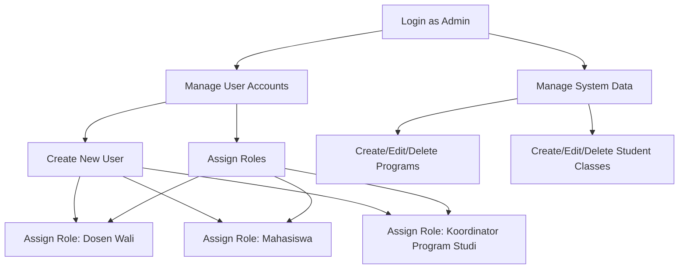
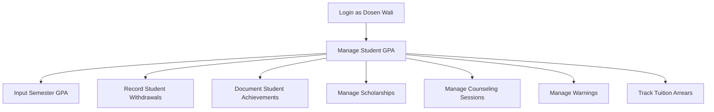
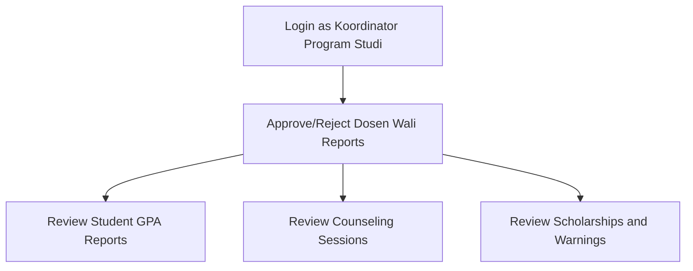
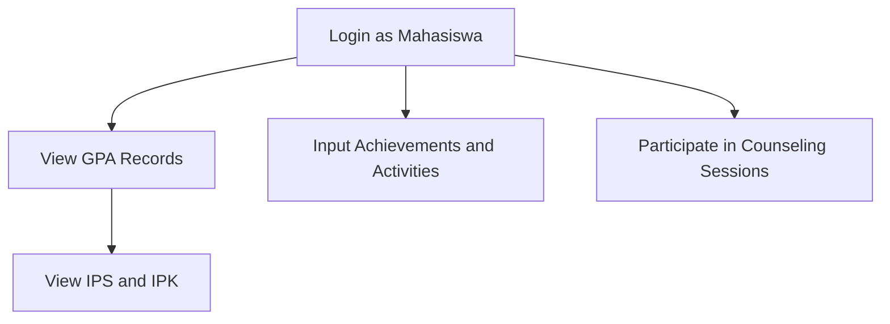

# JKB Academic Advising Information System

## Overview

JKB Academic Advising Information System (SIWALI JKB) is a comprehensive academic advising management system designed to streamline the process of managing student performance, counseling, and other academic data for higher education institutions.

## Features

### User Roles

The system supports four distinct user roles:

1. Admin
2. Dosen Wali (Academic Advisor)
3. Koordinator Program Studi (Program Coordinator)
4. Mahasiswa (Student)

### Role-specific Functionalities

#### 1. Admin

- Can manage all data within the system, except for student performance records and counseling sessions.
- Responsible for user management, including:
  - Creating new user accounts
  - Assigning roles (Dosen Wali, Koordinator Program Studi, or Mahasiswa) to users

#### 2. Dosen Wali (Academic Advisor)

- Manage and input students' semester GPA (IPS)
- Record students who have withdrawn (dropout) or are recipients of scholarships/revised tuition (UKT) reviews
- Document student achievements and organizational activities
- Manage records of students who have been issued warning letters
- Track tuition arrears
- Conduct online academic counseling (bimbingan perwalian)

#### 3. Koordinator Program Studi (Program Coordinator)

- Approve or reject reports submitted by Dosen Wali

#### 4. Mahasiswa (Student)

- View their semester GPA (IPS) and cumulative GPA (IPK)
- Input student achievements and organizational activities
- Participate in online academic counseling (bimbingan perwalian)

## ERD


## Entities

1. **users**: Stores user account information.
2. **programs**: Represents different academic programs offered.
3. **student_classes**: Represents classes or cohorts of students.
4. **positions**: Stores different positions (likely for lecturers).
5. **students**: Stores information about individual students.
6. **lecturers**: Contains data about faculty members.
7. **gpas**: Stores GPA information for students.
8. **gpa_details**: Detailed GPA information per semester.
9. **achievements**: Records student achievements.
10. **scholarships**: Manages information on student scholarships.
11. **guidance**: Manages student counseling records.
12. **warnings**: Documents warnings issued to students.
13. **tuition_arrears**: Manages records of unpaid tuition fees.

## Relationships

1. **users - students/lecturers**: One-to-one relationship. Each user account is associated with either a student or a lecturer.

2. **programs - student_classes**: One-to-many relationship. A program can have multiple student classes.

3. **student_classes - students**: One-to-many relationship. Each student class can have multiple students.

4. **lecturers - gpas**: One-to-many relationship. A lecturer can manage multiple student GPAs.

5. **gpas - gpa_details**: One-to-many relationship. Each GPA record contains multiple detailed entries per semester.

6. **students - achievements**: One-to-many relationship. A student can have multiple achievements.

7. **students - scholarships**: One-to-many relationship. A student can receive multiple scholarships.

8. **students - guidance**: One-to-many relationship. A student can participate in multiple counseling sessions.

9. **students - warnings**: One-to-many relationship. A student can receive multiple warnings.

10. **students - tuition_arrears**: One-to-many relationship. A student can have multiple tuition arrears records.

## Key Features

- The system supports soft deletes (deleted_at column) for most entities, allowing for data recovery and historical tracking.
- Timestamps (created_at, updated_at) are used across all tables for auditing purposes.
- The structure supports complex relationships between courses, lecturers, and students, allowing for flexible academic management.
- GPA, achievements, scholarships, and counseling systems are tightly integrated with the student management aspects of the database.

## Flowchart

### Admin Flowchart

### Dosen wali (Academic Advisor) Flowchart

### Koordinator Program Studi (Program Coordinator) Flowchart

### Mahasiswa (Student) Flowchart


## Installation

1. Clone the repository:
```
git clone https://github.com/Protic-PNC/jkb-sistem-perwalian.git
cd jkb-sistem-perwalian
```
2. Install dependencies:
```
composer install
npm install
npm run dev
```
3. Set up the environment:

Copy the .env.example file to .env and update the necessary environment variables.
```
cp .env.example .env
php artisan key:generate
```
4. Run database migrations:
```
php artisan migrate
```
5. Seed the database:
```
php artisan db:seed
```
6. Start the development server:
```
php artisan serve
```

## Usage

After completing the installation steps, you can access the application by navigating to http://localhost:8000 in your web browser. Log in with the credentials created during the seeding process.

The application uses Laravel Breeze for authentication. You can log in with the default super admin credentials:

- Email: -
- Password: -


## Contributing

We welcome contributions to this project! Please follow these steps to contribute:

Fork the repository:

1. Click the "Fork" button at the top right corner of this page to create a copy of this repository under your GitHub account.

2. Clone your forked repository:
```
git clone https://github.com/your-username/jkb-sistem-perwalian.git
cd jkb-sistem-perwalian
```
3. Create a new branch:
```
git checkout -b feature/your-feature-name
```
4. Make your changes and commit them:
```
git add .
git commit -m "Add a detailed description of your changes"
```
5. Push to your forked repository:
```
git push origin feature/your-feature-name
```
6. Create a pull request:

Open your forked repository on GitHub, select the new branch you created, and click "New pull request." Provide a clear description of your changes.

## Contact
For any questions or concerns, please contact the project maintainers at:

Email: afrizalfajri23@gmail.com
<br>
GitHub: Protic-PNC
