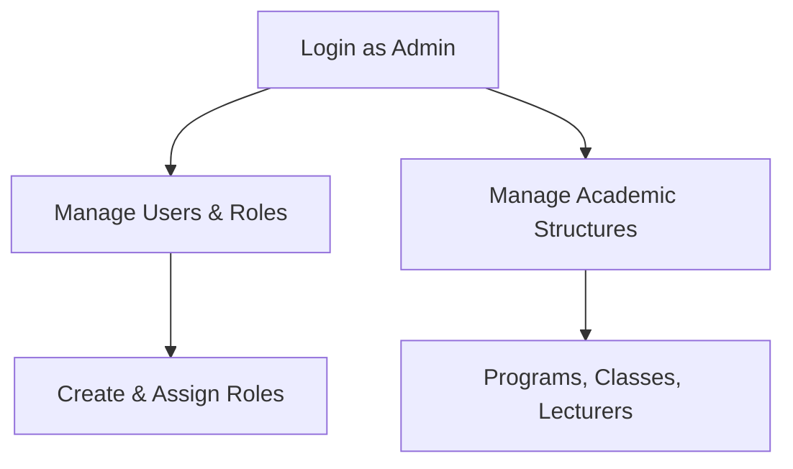
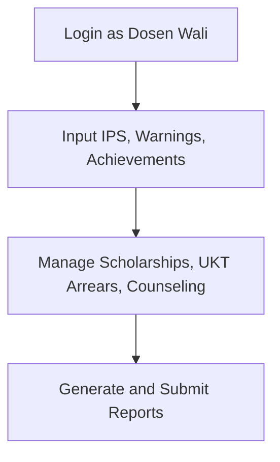
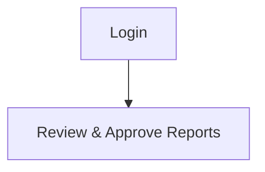
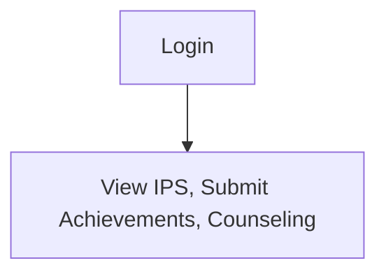
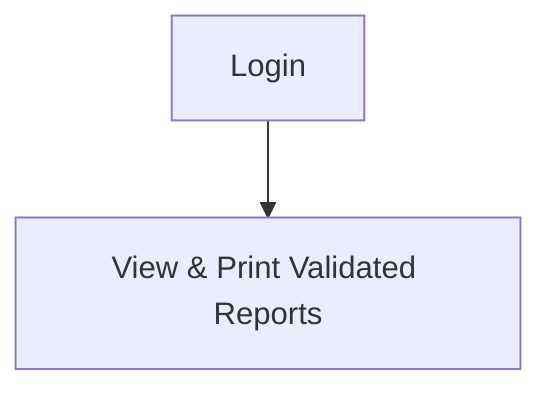

# SIWALI JKB - Academic Advisor Information System

## Overview

**SIWALI JKB (Sistem Informasi Dosen Wali JKB)** is a comprehensive academic advisor information system developed to manage and streamline academic supervision processes at higher education institutions. It supports the tracking and management of student performance, counseling, achievements, tuition arrears, and more.

---

## Features

### User Roles

The system supports five primary roles:

1. **Administrator**
2. **Dosen Wali (Academic Advisor)**
3. **Mahasiswa (Student)**
4. **Koordinator Program Studi (Program Coordinator)**
5. **Jurusan (Department)**

### Role-based Functionalities

#### 1. Administrator
- Login
- Manage user data (create/edit/delete)
- Manage academic programs, classes, lecturers, and their roles
- Handle KHS and KRS documents
- View and print Dosen Wali Reports
- Logout

#### 2. Dosen Wali
- Login
- Manage semester GPA (IPS)
- Input student warnings
- Record student resignations
- Input student achievements and organization activities
- Manage academic counseling records
- Input scholarship data
- Track UKT arrears
- View/download KHS
- Manage and print Dosen Wali Reports
- Logout

#### 3. Mahasiswa
- Login
- Input organization and achievement records
- Participate in counseling sessions
- View IPS
- Logout

#### 4. Koordinator Program Studi
- Login
- View and validate Dosen Wali Reports
- Print reports
- Logout

#### 5. Jurusan
- Login
- View and print validated Dosen Wali Reports
- Logout

---

## Database Design

### ERD


### Database

Download the SQL file here: [siwali_db.sql](./database/si_perwalian.sql)

### Entities and Relationships

Refer to the full list in the documentation for:
- `users`, `students`, `lecturers`, `programs`, `classes`, `positions`
- GPA structures: `gpas`, `gpas_cumulative`, `gpas_semester`
- Achievements, scholarships, guidances, warnings, arrears, resignations, and reports

Relationships include one-to-one and one-to-many mappings between students, advisors, classes, and various records for performance, achievements, and counseling.

---

## Flowcharts

### Admin


### Dosen Wali


### Koordinator Program Studi


### Mahasiswa


### Jurusan


---

## Installation

1. Clone the repository:
```bash
git clone https://github.com/Protic-PNC/jkb-sistem-dosen-wali.git
cd jkb-sistem-dosen-wali
```

2. Install dependencies:
```bash
composer install
npm install
npm run dev
```

3. Configure environment:
```bash
cp .env.example .env
php artisan key:generate
```

4. Run migrations and seeders:
```bash
php artisan migrate --seed
```

5. Start development server:
```bash
php artisan serve
```

---

## Usage

Visit `http://localhost:8000` in your browser.

Login with seeded credentials (see `DatabaseSeeder.php`):
- Email: -
- Password: -

---

## Contributing

1. Fork and clone the repository
```bash
git clone https://github.com/your-username/jkb-sistem-perwalian.git
cd jkb-sistem-perwalian
git checkout -b feature/your-feature-name
```

2. Make your changes
```bash
git add .
git commit -m "feat: add your feature description"
git push origin feature/your-feature-name
```

3. Open a Pull Request on GitHub

---

## Contact

📧 Email: afrizalfajri23@gmail.com  
💻 GitHub: [Protic-PNC](https://github.com/Protic-PNC)

---

## License

This project is open-source and available under the [MIT License](LICENSE).
